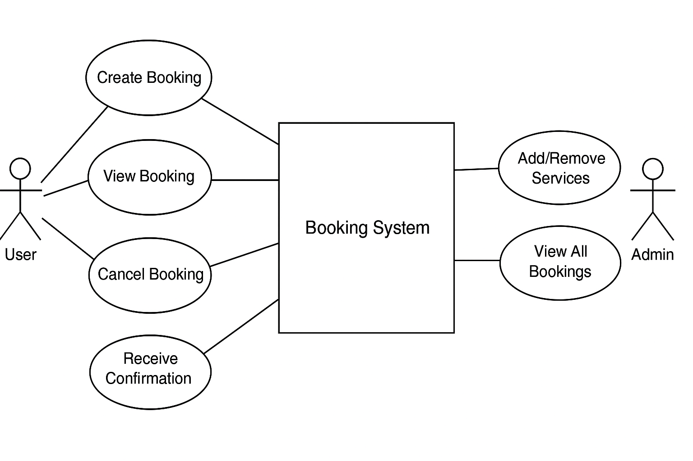

# 📋 Requirement Analysis in Software Development

## 🧭 Introduction

Welcome to the **Requirement Analysis** repository.

This repository explores the crucial process of requirement analysis in software development. Requirement analysis helps ensure that the software system meets stakeholder needs, solves the right problem, and defines clear, actionable features before any code is written.

Understanding and documenting requirements effectively is the foundation of successful projects — minimizing risks, reducing rework, and aligning development with user expectations.

Stay tuned for practical examples, documentation templates, and real-world scenarios that showcase how to conduct effective requirement analysis.

## 📖 What is Requirement Analysis?

**Requirement Analysis** is the process of identifying, gathering, interpreting, and documenting the needs and expectations of stakeholders for a software system. It serves as the foundation for planning, designing, and building software that solves the right problems and delivers value to users.

This phase is typically one of the first steps in the **Software Development Life Cycle (SDLC)** and plays a crucial role in shaping the direction of the entire project.

---

### 🔍 What Does Requirement Analysis Involve?

- **Stakeholder Interviews:** Understanding the goals, challenges, and expectations of users, clients, and other stakeholders.
- **Document Analysis:** Reviewing existing systems, processes, and documentation to inform new requirements.
- **Requirement Documentation:** Translating stakeholder input into clear, structured, and actionable software specifications.
- **Validation & Verification:** Ensuring the requirements are feasible, testable, complete, and aligned with business goals.

---

### 🚀 Importance in the SDLC

Requirement Analysis is vital in the SDLC because it:

- Ensures **clear alignment** between stakeholders and development teams.
- Sets a **solid foundation** for planning, estimation, and design.
- Reduces **scope creep** and unnecessary rework.
- Helps in identifying **risks, constraints, and dependencies** early in the process.

---

By conducting effective requirement analysis, software teams can build solutions that meet real needs, stay within budget, and deliver value on time.

## ❓ Why is Requirement Analysis Important?

Requirement Analysis is a foundational phase in the **Software Development Life Cycle (SDLC)** that ensures the project starts on the right path. It involves identifying, documenting, validating, and managing the needs and expectations of stakeholders.

Here are three key reasons why Requirement Analysis is essential:

---

### 1. 🎯 Ensures Clear Understanding of Project Goals

Requirement analysis helps all stakeholders (clients, developers, designers, and testers) understand what the software must achieve. This clarity avoids misunderstandings, scope creep, and misaligned expectations throughout the project lifecycle.

**Example:**  
Clearly defined login requirements prevent developers from implementing unnecessary features like biometric authentication if the client only expects email and password login.

---

### 2. 🛠️ Reduces Development Errors and Rework

When requirements are well-analyzed and documented upfront, the risk of building the wrong features or workflows is greatly reduced. This leads to fewer bugs, less rework, and better use of resources.

**Example:**  
If the analysis phase reveals that users need offline access, the system can be designed accordingly from the start—instead of re-architecting the app later.

---

### 3. 💸 Saves Time and Costs

Identifying gaps, conflicts, or ambiguities early prevents costly delays during development or testing. Time spent in analysis leads to more efficient coding, testing, and deployment phases.

**Example:**  
A well-structured requirement document can act as a checklist for developers and testers, streamlining implementation and reducing back-and-forth communication.

---

By investing time in requirement analysis, teams lay a strong foundation for **delivering software that is useful, usable, and successful.**

## 🧩 Key Activities in Requirement Analysis

Effective requirement analysis involves a structured set of activities to ensure that the software solution meets stakeholder expectations and business goals. Below are the five key activities involved in this process:

---

- **📥 Requirement Gathering**  
  Collecting raw data and information from stakeholders such as clients, users, and domain experts. This helps identify the core needs, expectations, and constraints.

  *Example:* Interviewing users to understand how they currently complete a task manually.

---

- **🧠 Requirement Elicitation**  
  Engaging stakeholders using techniques such as interviews, surveys, brainstorming sessions, or observation to uncover hidden or unspoken needs.

  *Example:* Hosting a focus group with users to uncover pain points that aren’t mentioned in formal documentation.

---

- **📝 Requirement Documentation**  
  Structuring and recording the gathered and elicited information in clear, concise formats such as Software Requirement Specifications (SRS), user stories, or use cases.

  *Example:* Creating a formal SRS document that outlines all user and system requirements for the development team.

---

- **📊 Requirement Analysis and Modeling**  
  Breaking down, analyzing, and organizing requirements to identify relationships, conflicts, priorities, and feasibility. This may include creating models like data flow diagrams, user personas, or process flows.

  *Example:* Building a user journey map to visualize how users interact with the system.

---

- **✅ Requirement Validation**  
  Ensuring that documented requirements are complete, clear, consistent, and aligned with stakeholder goals. This step often includes reviews, walkthroughs, and approval sessions.

  *Example:* Conducting a review meeting with stakeholders to validate the final SRS before development begins.

---

By systematically carrying out these activities, teams ensure that requirements are accurate, relevant, and actionable—leading to successful software development outcomes.

## 📂 Types of Requirements

In software development, requirements are generally classified into two main categories: **Functional Requirements** and **Non-functional Requirements**. Both are essential for delivering a successful and user-centered product.

---

### ⚙️ Functional Requirements

**Definition:**  
Functional requirements define what the system **should do**. They describe specific behaviors, features, and functions of the system from the user’s perspective.

**Examples for a Booking Management System:**
- Users can create new bookings by selecting a service, date, and time.
- The system sends a confirmation email to the user after a booking is made.
- Admins can add, update, or delete available services from the system.
- Users can cancel or reschedule bookings through their account dashboard.
- The system prevents double-booking for the same time slot and service.

Functional requirements are the backbone of the system’s core logic and help guide the development of the UI, backend, and user workflows.

---

### 🧪 Non-functional Requirements

**Definition:**  
Non-functional requirements describe **how the system should perform**. They cover system qualities such as performance, usability, reliability, and security.

**Examples for a Booking Management System:**
- The booking confirmation page should load within 2 seconds.
- The system should be available 99.9% of the time during working hours.
- Users should be able to access the platform on both mobile and desktop devices.
- All user data must be encrypted and stored securely.
- The system should support up to 10,000 concurrent users without crashing.

Non-functional requirements ensure that the system is efficient, reliable, and pleasant to use—contributing to a high-quality user experience.

---

Both functional and non-functional requirements must be addressed to build a system that is not only **correct** but also **usable, secure, and scalable**.

## 🧾 Use Case Diagrams

### What is a Use Case Diagram?

A **Use Case Diagram** is a visual representation of the interactions between users (actors) and a system. It shows the various ways users can interact with the system and helps communicate **functional requirements** clearly and efficiently.

---

## 🧾 Use Case Diagrams

### What is a Use Case Diagram?

A **Use Case Diagram** is a visual representation of the interactions between users (actors) and a system. It shows the various ways users can interact with the system and helps communicate **functional requirements** clearly and efficiently.

---

### 🎯 Benefits of Use Case Diagrams

- Simplifies complex functionality into visual interactions
- Helps identify user roles and responsibilities
- Acts as a communication bridge between stakeholders, designers, and developers
- Assists in validating system scope and ensuring all use cases are covered

---

### 🧩 Use Case Diagram: Booking Management System

Below is a use case diagram for a simple booking system. It outlines how different actors interact with the system:

